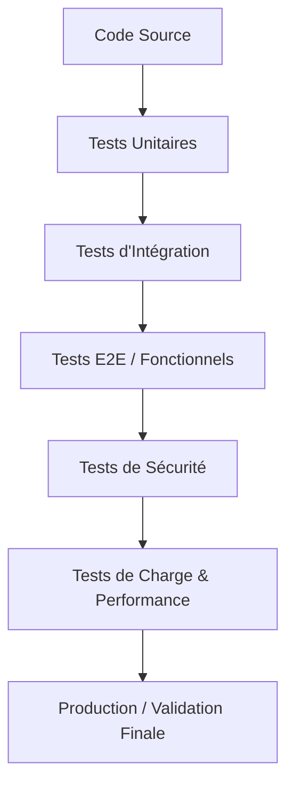

# 📑 Guide de Validation & Tests de Charge pour vos Projets Web

Ce document présente une vue d'ensemble des **tests de charge** de base mis en place dans vos modèles Locust ainsi qu'une **méthodologie complète de validation** pour assurer la qualité, la performance et la sécurité d'une application avant sa mise en production.

---

## 🚀 1. Les Tests de Charge de Base (Modèles Locust)

Nous avons configuré quatre scénarios clés dans le dossier [scenarios](file:///c:/Users/Toto.ADMINISTRATOR/Desktop/Krsidoine%20Automatisations/SAAS/locust-master/locust-template/scenarios/) pour couvrir les cas d'utilisation universels de n'importe quel site web :

| Scénario | Fichier | Description / Utilité |
| :--- | :--- | :--- |
| **Navigation Publique** | [basic_test.py](file:///c:/Users/Toto.ADMINISTRATOR/Desktop/Krsidoine%20Automatisations/SAAS/locust-master/locust-template/scenarios/basic_test.py) | Visite de pages statiques anonymes (Accueil, À propos). Utile pour mesurer les performances du serveur web (Nginx/Apache) et de la mise en cache. |
| **Authentification Simple** | [auth_test.py](file:///c:/Users/Toto.ADMINISTRATOR/Desktop/Krsidoine%20Automatisations/SAAS/locust-master/locust-template/scenarios/auth_test.py) | Connexion d'un utilisateur au démarrage (`on_start`), récupération du jeton JWT et injection automatique dans les en-têtes d'autorisation (`Authorization: Bearer <token>`) pour les requêtes protégées suivantes. |
| **Sécurité Anti-CSRF** | [csrf_test.py](file:///c:/Users/Toto.ADMINISTRATOR/Desktop/Krsidoine%20Automatisations/SAAS/locust-master/locust-template/scenarios/csrf_test.py) | Extraction dynamique du jeton CSRF depuis le code HTML du formulaire via Regex (requis par Django, Laravel, Symfony, etc.) avant de soumettre une requête POST. |
| **Données Dynamiques (Multi-comptes)** | [dynamic_auth_test.py](file:///c:/Users/Toto.ADMINISTRATOR/Desktop/Krsidoine%20Automatisations/SAAS/locust-master/locust-template/scenarios/dynamic_auth_test.py) | Utilisation d'un fichier CSV ([users.csv](file:///c:/Users/Toto.ADMINISTRATOR/Desktop/Krsidoine%20Automatisations/SAAS/locust-master/locust-template/data/users.csv)) et d'une file d'attente (`Queue`) pour connecter des centaines d'utilisateurs réels différents sans collisions de sessions. |
| **Stress Base de Données (DB)** | [db_intensive_test.py](file:///c:/Users/Toto.ADMINISTRATOR/Desktop/Krsidoine%20Automatisations/SAAS/locust-master/locust-template/scenarios/db_intensive_test.py) | Simule des requêtes SQL lourdes (recherches à filtres aléatoires, calculs de statistiques agrégées et écritures en POST) pour tester les limites physiques du serveur de base de données. |

> [!TIP]
> **Comment choisir le bon point de départ ?**
> - Pour un site vitrine simple, commencez par `basic_test.py`.
> - Pour une SPA (React, Vue, Angular) ou une API REST avec JWT, utilisez `auth_test.py` ou `dynamic_auth_test.py`.
> - Pour un site traditionnel rendu côté serveur (SSR) avec formulaires sécurisés, utilisez `csrf_test.py`.

---

## 🛠️ 2. Quels tests effectuer pour valider un Projet ou une Application ?

Pour garantir qu'un projet est prêt à être livré et supporte la vie réelle, il doit passer par différents niveaux de tests complémentaires. Voici la check-list professionnelle de validation :

### 🧪 A. Les Tests Fonctionnels & Logiques

#### 1. Tests Unitaires (Unit Tests)
* **Objectif** : Valider le comportement isolé d'une fonction, d'une classe ou d'une méthode, sans dépendance externe (on utilise des "mocks" pour simuler la base de données ou les APIs).
* **Outils fréquents** : Pytest (Python), Jest / Vitest (JavaScript), JUnit (Java).
* **Quand** : Durant tout le développement (idéalement en approche TDD).

#### 2. Tests d'Intégration (Integration Tests)
* **Objectif** : S'assurer que les différents modules de l'application fonctionnent bien ensemble (par exemple : vérifier qu'un appel d'API écrit correctement les données en base de données).
* **Outils fréquents** : Pytest avec bases de données de test Dockerisées, Postman / Newman.

#### 3. Tests de Bout en Bout (E2E / End-to-End)
* **Objectif** : Simuler le parcours exact d'un utilisateur dans un vrai navigateur web (cliquer sur un bouton, remplir un formulaire, valider un panier).
* **Outils fréquents** : **Playwright** (fortement recommandé), **Cypress**, Selenium.

---

### ⚡ B. Les Tests de Performance (Charge & Stabilité)

L'exécution de tests de charge ne consiste pas simplement à "envoyer le maximum de requêtes". Il faut suivre une méthodologie progressive :

1. **Smoke Test (Test de fumée)** : 
   - Lancer le test avec 1 à 2 utilisateurs simulés pendant 2 minutes.
   - *Objectif* : Vérifier que le script de test fonctionne correctement sans erreurs de script.
2. **Load Test (Test de charge nominale)** : 
   - Simuler le nombre maximal d'utilisateurs attendus en production (ex: 500 utilisateurs simultanés) pendant 30 à 60 minutes.
   - *Objectif* : Valider les temps de réponse moyens, le taux d'erreur (< 1%) et le comportement sous trafic normal.
3. **Stress Test (Test de résistance)** : 
   - Augmenter continuellement le nombre d'utilisateurs jusqu'à ce que l'application s'effondre ou renvoie des erreurs HTTP 500/502/504.
   - *Objectif* : Identifier les goulots d'étranglement (CPU, RAM, base de données) et comprendre la limite physique de l'infrastructure.
4. **Soak / Endurance Test (Test d'endurance)** : 
   - Maintenir une charge moyenne (ex: 70% de la capacité) pendant plusieurs heures (6h, 12h ou même 24h).
   - *Objectif* : Détecter les fuites de mémoire (memory leaks), la saturation d'espace disque (logs) ou l'épuisement des connexions à la base de données.
5. **Spike Test (Test de pic)** : 
   - Envoyer un pic soudain d'utilisateurs (ex: de 10 à 1000 en 10 secondes) puis redescendre brusquement.
   - *Objectif* : Tester la réactivité de l'autoscaling et la capacité du serveur à absorber un afflux massif (ex: Black Friday, envoi de newsletter).

---

### 🔒 C. Les Tests de Sécurité (DevSecOps)

#### 1. Analyse Statique de Sécurité (SAST)
* **Objectif** : Scanner le code source à la recherche de vulnérabilités (mots de passe en dur, failles d'injection, configurations peu sécurisées).
* **Outils** : Bandit (Python), ESLint Security (JS), SonarQube.

#### 2. Analyse Dynamique (DAST)
* **Objectif** : Attaquer l'application en cours d'exécution pour découvrir des failles (XSS, injections SQL, mauvaise gestion des en-têtes de sécurité).
* **Outils** : OWASP ZAP, Nikto.

#### 3. Audit des Dépendances (SCA)
* **Objectif** : Vérifier que vos bibliothèques tierces n'ont pas de failles de sécurité connues.
* **Outils** : `npm audit` (JS), `pip-audit` / `safety` (Python), Snyk.

---

### 👁️ D. L'Accessibilité (a11y), l'UX et le SEO

#### 1. Tests d'Accessibilité (WCAG / RGAA)
* **Objectif** : S'assurer que le site est utilisable par des personnes en situation de handicap (lecteurs d'écran, navigation clavier).
* **Outils** : Axe Core, Lighthouse.

#### 2. Tests de Compatibilité (Cross-Browser & Responsive)
* **Objectif** : S'assurer que l'application s'affiche correctement sur Safari (iOS), Chrome (Android/Desktop), Firefox, Edge, et sur les tailles d'écrans mobiles.
* **Outils** : BrowserStack, ou les profils d'appareils de Playwright.

#### 3. Tests SEO & Métriques Web (Core Web Vitals)
* **Objectif** : Valider la vitesse de chargement et le balisage sémantique pour plaire à Google.
* **Outils** : Google Lighthouse / Pagespeed Insights.

---

## 📈 Synthèse de validation : La check-list "Prêt pour la Prod"

Avant de livrer votre application, assurez-vous d'avoir coché les cases suivantes :

- [ ] **Couverture de code minimale** : Au moins 70-80% des fonctions critiques testées unitairement.
- [ ] **Parcours critiques E2E validés** : Inscription, paiement, modification du profil fonctionnent sans erreur visuelle ou technique.
- [ ] **Aucun secret en dur** : Les clés API, mots de passe et secrets JWT sont dans des variables d'environnement (`.env`).
- [ ] **Dépendances à jour** : Aucun paquet vulnérable signalé par l'outil de scan de dépendances.
- [ ] **Performance validée** : Le temps de réponse moyen reste inférieur à 1,5 seconde sous charge nominale.
- [ ] **Limites identifiées** : Vous connaissez le point de rupture (nombre d'utilisateurs max) du serveur.
- [ ] **Accessibilité validée** : Score Lighthouse Accessibilité > 90%.
