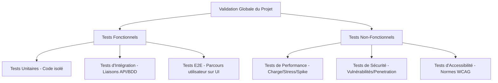

# Skill : Exécuter des Tests de Charge avec Locust

Ce skill décrit la procédure pour configurer, exécuter et analyser des tests de performance (charge, résistance, endurance) de manière automatisée à l'aide de Locust, en intégrant les méthodologies et bonnes pratiques professionnelles de la QA Automation (Assurance Qualité et Automatisation).

---

## 1. Concepts Fondamentaux : Qu'est-ce qu'un Testeur Automatique ?

Dans l'ingénierie logicielle, le terme **Testeur Automatique** a une double signification :

### A. L'Outil / Script de Test Automatisé
Il s'agit d'un logiciel ou d'un script écrit pour simuler des actions humaines ou des requêtes réseau de manière répétée, rapide et autonome.
* **Locust** agit comme un testeur automatique de charge et de performance. Il simule des milliers d'utilisateurs virtuels qui naviguent simultanément sur une application pour tester ses limites.

### B. Le Rôle / Ingénieur QA Automation (Quality Assurance)
C'est le professionnel qui conçoit la stratégie de test, écrit les scénarios sous forme de code et met en place les pipelines d'automatisation. Son travail suit une méthodologie rigoureuse pour garantir que chaque déploiement est stable, performant et exempt de régressions.

---

## 2. Les 5 Types de Tests de Charge de Base pour n'importe quel Site

Pour tester la charge de manière rigoureuse, il ne suffit pas de lancer un seul test au hasard. Il faut effectuer 5 types de tirs distincts avec des objectifs différents :

1. **Le Test de Fumée (Smoke Test / Verification)** :
   * **Principe** : Lancer un très petit nombre d'utilisateurs (ex: 2 à 5 utilisateurs) pendant 1 à 2 minutes.
   * **But** : Vérifier que le script de test n'a pas de bug de syntaxe ou d'authentification et que les serveurs répondent correctement.
2. **Le Test de Charge Nominale (Load Test)** :
   * **Principe** : Simuler la charge maximale attendue en production lors d'une utilisation normale (ex: 50 utilisateurs simultanés pendant 15 à 30 minutes).
   * **But** : Vérifier que l'application répond en-dessous du seuil de latence toléré (SLA) dans un scénario classique.
3. **Le Test de Stress (Stress Test)** :
   * **Principe** : Augmenter la charge de manière progressive (en rampe) au-delà des limites théoriques (ex: de 0 à 500 utilisateurs) jusqu'à ce que le serveur commence à ralentir ou à échouer.
   * **But** : Identifier le **point de rupture** (Breaking Point) et s'assurer que le système échoue proprement (pas de plantage complet de la base de données).
4. **Le Test de Pic (Spike Test)** :
   * **Principe** : Envoyer une vague soudaine d'utilisateurs en un temps très court (ex: passer de 5 à 150 utilisateurs en 10 secondes), puis couper le trafic tout aussi vite.
   * **But** : Simuler une arrivée massive (ex: newsletter, alerte SMS, ouverture de billetterie) pour voir si le serveur met à l'échelle (auto-scaling) et gère la file d'attente sans crasher.
5. **Le Test d'Endurance (Soak Test / Endurance)** :
   * **Principe** : Maintenir une charge moyenne/haute constante pendant plusieurs heures (ex: 3h, 12h ou 24h).
   * **But** : Détecter les fuites de mémoire (memory leaks), la saturation d'espace disque (logs), ou le non-renouvellement des connexions aux bases de données.

---

## 3. Les Différents Tests pour Valider un Projet / Application (Qualité A à Z)

Pour qu'un projet ou une application soit considéré comme stable et "prêt pour la production" (Production-Ready), il doit passer par différents types de validations :



### A. Les Tests Fonctionnels (Valider le comportement)
* **Tests Unitaires (Unit Tests)** : Testent les plus petites parties de code (fonctions, classes) de manière isolée pour s'assurer que les calculs et la logique sont corrects.
* **Tests d'Intégration (Integration Tests)** : Vérifient la communication et le flux de données entre plusieurs composants (ex: tester qu'une route API enregistre bien en base de données).
* **Tests de Bout-en-Bout (E2E / End-to-End)** : Simulent un utilisateur réel ouvrant un navigateur et effectuant des actions concrètes (remplir un formulaire, cliquer sur un bouton de paiement) avec des outils comme **Playwright** ou **Cypress**.

### B. Les Tests Non-Fonctionnels (Valider la robustesse et la conformité)
* **Tests de Performance (Performance & Load)** : Analyse de la vitesse, de la réactivité et des limites de charge (Locust).
* **Tests de Sécurité (Security Testing)** : Recherche de vulnérabilités (scanners de dépendances pour les bibliothèques obsolètes, analyse de failles XSS/Injections SQL).
* **Tests d'Accessibilité (a11y)** : S'assurer que le site respecte les normes (ex: WCAG / RGAA) pour être utilisable par des personnes en situation de handicap (lecteurs d'écran, navigation clavier).
* **Tests de Compatibilité (Cross-Browser)** : Vérifier que l'application s'affiche et réagit correctement sur tous les navigateurs (Chrome, Safari, Firefox, Edge) et formats d'écrans (Mobile, Tablette, Desktop).

---

## 4. Méthodologies et Bonnes Pratiques QA de A à Z

Pour mener à bien une campagne de tests de charge de niveau professionnel, vous devez appliquer les étapes et principes rigoureux suivants :

### A. Phase de Découverte et Cartographie d'Impact
Avant d'écrire la moindre ligne de code de test, analysez l'application cible :
1. **Cartographier les fonctionnalités (Impact Mapping)** :
   * **Impact Élevé (High-Impact)** : Écritures en base de données, création de comptes, paiement, génération de PDF, authentification (génération de jetons JWT).
   * **Impact Moyen (Medium-Impact)** : Requêtes de lecture dynamique, affichage de tableaux de bord complexes.
   * **Impact Faible (Low-Impact)** : Pages statiques (Accueil, Mentions Légales), fichiers statiques.
2. **Pondérer les scénarios** : Vos tests doivent simuler un parcours utilisateur réel. Par exemple, 70% des utilisateurs lisent du contenu, 20% ajoutent au panier, et seulement 10% passent commande.

### B. Stratégie de Test et Seuils de Performance (SLA / SLO)
Définissez clairement les objectifs de performance de l'application (Service Level Objectives) :
* **Latence Acceptable** : Le temps de réponse percentile 95 (p95) doit être inférieur à un certain seuil (ex: `p95 < 1500 ms`).
* **Taux d'Erreur Toléré** : Le pourcentage de requêtes en échec doit être quasi nul (ex: `< 1%` ou `< 2%` sous forte charge).
* **Débit Cible (RPS)** : Le nombre minimal de requêtes par seconde que le système doit absorber de façon stable.

### C. Isolation et Étanchéité de l'Environnement
* **NE JAMAIS tester sur l'environnement de production** sous peine de perturber les vrais utilisateurs ou de corrompre les données réelles.
* Utiliser un environnement de **Staging (Pré-production)** configuré de manière aussi identique que possible à la production (mêmes specs de base de données, ressources CPU/RAM identiques).
* Désactiver ou simuler (mocker) les services tiers payants ou externes (ex: passerelles de paiement Stripe, envois d'e-mails réels) pour éviter de saturer des API tierces ou de générer des frais.

### D. Gestion et Rotation des Données de Test (Data Seeding)
* **Éviter le biais de cache de base de données** : Si 1000 utilisateurs virtuels interrogent en boucle le profil de l'utilisateur avec l'ID `1`, la base de données va stocker ce profil en mémoire cache. Vos résultats seront artificiellement excellents.
* **Méthodologie** : Injectez un large jeu de données (Data Seeding) et lisez des identifiants différents à chaque requête (rotation des IDs d'utilisateurs, de produits, etc.).
* **Nettoyage (Teardown)** : Prévoyez des scripts pour nettoyer la base de données après le test afin de ne pas la polluer avec des millions d'enregistrements de test.

### E. Simulation Réaliste du Comportement Utilisateur
* **Temps de réflexion (Think Time)** : Les humains ne cliquent pas instantanément. Utilisez `between(min, max)` pour simuler une pause réaliste entre chaque action (ex: entre 1 et 3 secondes).
* **Gestion des sessions** : Assurez-vous que chaque utilisateur virtuel conserve ses propres cookies et en-têtes HTTP de manière isolée.
* **Authentification et sécurité (Jetons CSRF / JWT)** : Récupérez dynamiquement le jeton de session ou le CSRF token lors de la première requête et injectez-le dans les en-têtes des requêtes suivantes.

---

## 5. Prérequis et Initialisation du Projet

Avant de lancer un test, l'agent doit :
1. S'assurer que l'environnement virtuel `.venv` dans le projet est activé.
2. Si Locust n'est pas encore installé ou configuré, exécuter le script d'automatisation d'installation :
   ```bash
   python setup.py
   ```
3. Vérifier que le fichier de scénario (ex: `scenarios/basic_test.py`) compile sans erreur.

---

## 6. Lancement des Tests en Mode Headless (Automatisation)

Pour exécuter un test sans interface graphique et enregistrer directement les métriques dans des fichiers (idéal pour l'automatisation en CI/CD), utilisez la commande suivante :

```bash
locust -f <chemin_scenario> --headless -u <nombre_utilisateurs> -r <taux_injection> -t <duree_test> --host <url_cible> --csv=<prefixe_export> --html=<chemin_rapport_html>
```

### Paramètres de commande :
* `-f` : Chemin vers le fichier de scénario Python (ex: `scenarios/basic_test.py`).
* `--headless` : Désactive l'interface web pour une exécution directe en ligne de commande.
* `-u` : Nombre total d'utilisateurs virtuels simulés en parallèle.
* `-r` : Taux d'apparition par seconde (nombre d'utilisateurs ajoutés par seconde jusqu'à atteindre `-u`).
* `-t` : Durée du test (ex: `30s` pour 30 secondes, `2m` pour 2 minutes, `1h` pour 1 heure).
* `--host` : URL racine du serveur cible à tester (ex: `http://localhost:3000`).
* `--csv` : Préfixe pour nommer les fichiers CSV de statistiques exportés (ex: `results/tir_1`).
* `--html` : Chemin optionnel pour exporter un rapport graphique complet en HTML (ex: `results/rapport.html`).

---

## 7. Recherche de la Limite de Charge et Point de Rupture (Stress Testing)

Pour identifier la capacité maximale (limite de sécurité) et le point de rupture (breaking point) du système testé, exécutez une rampe de charge progressive.

### A. Lancement du Stress Test
Utilisez le script d'automatisation de stress test inclus pour lancer une montée en charge progressive :
```bash
python scripts/run_stress_test.py -f <chemin_scenario> -u <charge_max> -r <pas_utilisateurs> -t <duree> --host <url_cible>
```

### B. Détection Automatique de la Rupture
Le script identifie automatiquement le point de rupture selon les critères définis dans notre plan de test (SLA/SLO) :
* **Taux d'erreur > 2%** de façon continue.
* **Temps de réponse percentile 95 (p95) > 1500 ms**.

Le script calcule alors :
1. **La limite de sécurité** : La charge maximale (utilisateurs et RPS) supportée de manière stable juste avant le début de la dégradation.
2. **Le point de rupture** : Le nombre d'utilisateurs simultanés ayant provoqué l'effondrement des performances ou le dépassement des SLAs.

### C. Restitution des Livrables Professionnels
Après l'analyse, l'agent doit sauvegarder les fichiers de rapport suivants dans le dossier `results/` :
1. **`kpi_rupture_stats.csv`** : Synthèse propre du point de rupture et des limites pour archivage ou traitement externe.
2. **`stress_dashboard.html`** : Un tableau de bord interactif complet (Neon Dark Mode) contenant :
   * **KPIs Cards** : Limites de sécurité et points de rupture bien visibles.
   * **Donut Chart** : Proportion globale succès vs échecs.
   * **Line Chart** : Évolution de la charge, du RPS et du p95 seconde par seconde.
   * **Tableau Croisé Dynamique (Pivot Table)** : Analyse détaillée des performances par endpoint.

---

## 8. Conception de Scénarios en Python (Bonnes Pratiques de Code)

Les scénarios de test doivent être écrits dans le dossier `scenarios/` (ex: `scenarios/test_checkout.py`).

### A. Structure de Base avec HttpUser
Hériter de la classe `HttpUser` de Locust et définir un temps d'attente réaliste :
```python
from locust import HttpUser, task, between

class ProjectUser(HttpUser):
    # Simuler une pause réaliste de 1 à 3 secondes entre les actions
    wait_time = between(1, 3)
```

### B. Définition des Tâches et Poids (Pondération)
Décorer les méthodes de requêtes avec `@task` pour simuler le parcours utilisateur :
```python
    @task(3)
    def visiter_accueil(self):
        self.client.get("/")

    @task(1)
    def visiter_contact(self):
        self.client.get("/contact")
```

### C. Gestion Dynamique de l'Authentification
Utiliser la méthode de cycle de vie `on_start(self)` pour récupérer un Token et l'appliquer à toutes les requêtes futures de l'utilisateur virtuel :
```python
    def on_start(self):
        # S'authentifier au démarrage de la simulation de cet utilisateur
        response = self.client.post("/api/login", json={
            "username": "testuser",
            "password": "securepassword"
        })
        if response.status_code == 200:
            token = response.json().get("token")
            # Injecter le header Authorization pour toutes les tâches suivantes
            self.client.headers.update({"Authorization": f"Bearer {token}"})
```

---

## 9. Intégration Continue (CI/CD) et Surveillance (Observabilité)

### A. Intégration Continue (CI/CD Gates)
Automatisez les tests de performance dans vos workflows de développement (ex: GitHub Actions) :
* Exécutez un test de charge rapide (smoke test / non-régression) à chaque modification de code importante.
* Configurez des critères de réussite (Gates) : si le temps de réponse p95 augmente de plus de 10% par rapport à la version précédente, faites échouer le déploiement.

### B. Corrélation des Métriques et Observabilité (Monitoring)
Un test de charge seul ne donne que des résultats externes (RPS, latence). Pour comprendre *pourquoi* le serveur sature :
* **Surveillez le serveur cible** pendant le test (usage CPU, mémoire vive saturée, E/S disque, nombre de connexions à la base de données).
* **Corréler les graphiques** : Si le p95 augmente au même moment où le CPU du serveur cible atteint 100%, le processeur est le goulot d'étranglement. Si la latence augmente mais que le CPU est bas, vérifiez les verrous de base de données (Database Locks) ou la bande passante réseau.

---

## 10. Scripts d'Automatisation Inclus

Le skill fournit deux scripts d'automatisation dans son dossier `scripts/` :
* `run_headless.py` : Pour lancer un test simple en mode non interactif, parser le CSV et sortir un rapport Markdown.
* `run_stress_test.py` : Pour lancer une montée de charge progressive, détecter automatiquement le point de rupture et générer le tableau de bord HTML interactif.
