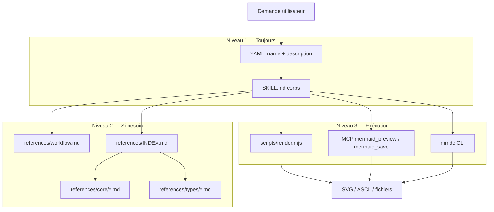

# Architecture — skill-mermaidH

Skill agent **unifié** qui fusionne les approches de `agent-toolkit/mermaid-diagrams`, `mermaid-skill`, `Pretty-mermaid-skills`, `claude-mermaid`, `c4-architecture` et les bonnes pratiques de `skill-creator`.

## Objectif

Permettre à l’agent de **concevoir, valider, styliser et exporter** des diagrammes Mermaid (texte → rendu) pour la documentation technique, l’architecture et la modélisation — avec une seule entrée (`SKILL.md`) et des ressources chargées à la demande.

## Structure des fichiers

```
skill-mermaidH/
├── SKILL.md                 # Point d’entrée : workflow, règles, routage
├── ARCHITECTURE.md          # Ce document
├── package.json             # Dépendance beautiful-mermaid (rendu SVG/ASCII)
├── evals/
│   └── evals.json           # Cas de test suggérés (skill-creator)
├── scripts/
│   ├── render.mjs           # Rendu unitaire SVG/ASCII
│   ├── batch.mjs            # Rendu par lot
│   └── themes.mjs           # Liste des thèmes
├── assets/
│   └── example_diagrams/    # Modèles .mmd (flowchart, sequence, …)
└── references/
    ├── INDEX.md             # Table des matières + routage
    ├── workflow.md          # Processus unifié (5 phases)
    ├── integrations.md      # MCP, CLI mmdc, Markdown, Live Editor
    ├── core/                # Guides détaillés (agent-toolkit)
    │   ├── class-diagrams.md
    │   ├── sequence-diagrams.md
    │   ├── flowcharts.md
    │   ├── erd-diagrams.md
    │   ├── c4-diagrams.md
    │   ├── architecture-diagrams.md
    │   └── advanced-features.md
    ├── types/               # Syntaxe officielle par type (mermaid-skill, 23+ types)
    │   ├── flowchart.md
    │   ├── sequenceDiagram.md
    │   ├── c4.md
    │   └── …
    ├── c4/                  # Modèle C4 approfondi
    │   ├── c4-syntax.md
    │   ├── advanced-patterns.md
    │   └── common-mistakes.md
    └── render/              # Thèmes et API beautiful-mermaid
        ├── THEMES.md
        ├── DIAGRAM_TYPES.md
        └── api_reference.md
```

## Flux de données (chargement progressif)



## Sources fusionnées

| Source d’origine | Apport dans skill-mermaidH |
|------------------|----------------------------|
| agent-toolkit `mermaid-diagrams` | Sélection de type, bonnes pratiques, `references/core/` |
| mermaid-skill | Catalogue 23+ types, `references/types/` |
| Pretty-mermaid-skills | Scripts de rendu, thèmes, `references/render/` |
| claude-mermaid | Workflow preview live, `references/integrations.md` |
| c4-architecture | Niveaux C4, pièges, `references/c4/` |
| skill-creator | Structure skill, evals, disclosure progressive |

## Pipeline métier (5 phases)

1. **Comprendre** — Audience, niveau d’abstraction, livrable (Markdown, SVG, doc architecture).
2. **Choisir** — Arbre de décision type de diagramme (voir `SKILL.md` + `references/INDEX.md`).
3. **Rédiger** — Syntaxe Mermaid validée ; lire la référence du type avant de coder.
4. **Valider** — Mermaid Live, preview MCP, ou `render.mjs` pour détecter les erreurs tôt.
5. **Livrer** — Bloc ` ```mermaid `, fichier `.mmd`, export SVG/PNG selon le contexte.

## Modes de sortie

| Mode | Quand | Outil |
|------|--------|--------|
| Markdown embarqué | README, PR, wiki | Bloc mermaid dans `.md` |
| Preview live | Itération rapide avec l’utilisateur | MCP `mermaid_preview` (si disponible) |
| SVG/ASCII soigné | Docs, slides, README terminal | `scripts/render.mjs` |
| PNG/PDF batch | CI, livrables figés | `mmdc` ou MCP `mermaid_save` |

## Principes de conception du skill

- **Une intention, un diagramme** — Scinder les vues trop larges (contexte vs conteneur vs composant).
- **Syntaxe d’abord, style ensuite** — Le rendu échoue silencieusement sur des fautes de mot-clé.
- **Pas de surprise** — Pas d’exécution réseau non demandée ; scripts locaux documentés.
- **Généralisable** — Règles expliquées (pourquoi) plutôt que listes MUST opaques.

## Installation (Cursor)

Copier le dossier vers un emplacement skills :

```text
# Projet
<repo>/.cursor/skills/skill-mermaidH/

# Personnel (tous projets)
%USERPROFILE%\.cursor\skills\skill-mermaidH\
```

Invoquer explicitement : `@skill-mermaidH` ou mentionner diagramme Mermaid / architecture / ERD.

## Évolution

- Itérer via `evals/evals.json` et le cycle skill-creator (workspace `skill-mermaidH-workspace/`).
- Enrichir `references/types/` quand Mermaid ajoute de nouveaux diagrammes.
- Optionnel : sous-skill dédié uniquement C4 si le corps dépasse ~500 lignes.
