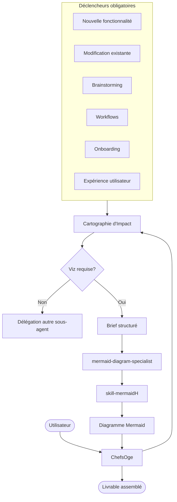
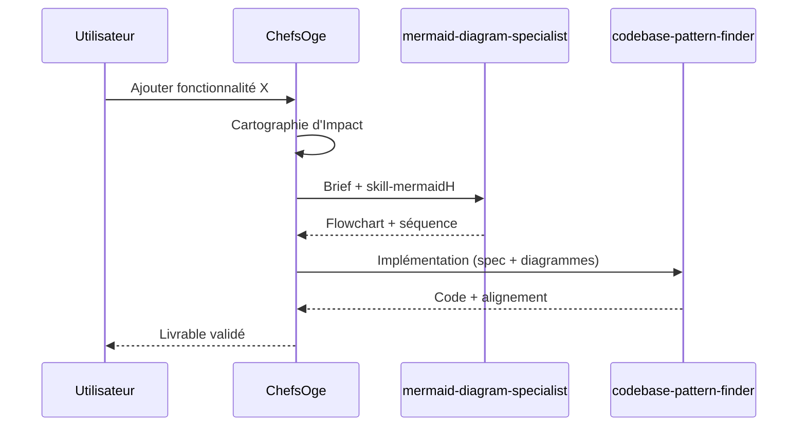

# Intégration ChefsOge — skill-mermaidH

Ce skill s’exécute sous l’orchestration de **ChefsOge** (manager du projet). Il sert à **visualiser les flux** avant, pendant et après les décisions — pas seulement pour documenter a posteriori.

**Chemins relatifs** (depuis `ChefsOge/`) :
- Manager : `./SKILL.md`
- Manifeste global : `./manifeste_competence.md`
- Sous-agent dédié : `./agents/mermaid-diagram-specialist.md`
- Ce skill : `./banques_skills/skills-globales/skill-mermaidH/SKILL.md`

## Flux de délégation



### Rôle de ChefsOge

1. **Cartographie d'Impact** — Avant toute action, identifier si un diagramme clarifie le flux, les acteurs ou les impacts.
2. **Délégation** — Invoquer `mermaid-diagram-specialist` avec le skill `skill-mermaidH` et un brief conforme au manifeste global.
3. **Supervision** — Aucun sous-agent ne sollicite un autre sans validation du manager.
4. **Assemblage** — Intégrer le diagramme dans la livraison (PR, doc, mémoire `memoire-oge-academie/`).

### Format de brief (extrait)

```markdown
[DÉLÉGATION SOUS-AGENT]
- **Cartographie d'Impact** : [Objectif / Acteurs / Impacts / Livrables]
- **Rôle attendu** : mermaid-diagram-specialist
- **Skill à charger** : banques_skills/skills-globales/skill-mermaidH/SKILL.md
- **Manifeste agent** : agents/manifestes/mermaid-diagram-specialist_manifest.md
- **Contexte** : [brainstorming | nouvelle fonctionnalité | modification | workflow | onboarding | UX]
- **Type de diagramme suggéré** : [flowchart | sequenceDiagram | stateDiagram-v2 | userJourney | C4Context | erDiagram]
- **Tâche à accomplir** : [Description + critères de validation]
```

## Quand diagrammer (déclencheurs ChefsOge)

| Contexte | Objectif du diagramme | Type recommandé |
|----------|----------------------|-----------------|
| **Brainstorming** | Structurer les idées, options, décisions | flowchart, mindmap, quadrantChart |
| **Nouvelle fonctionnalité** | Flux métier, intégrations, impacts | flowchart + sequenceDiagram |
| **Modification existante** | État avant/après, points de rupture | flowchart, stateDiagram-v2, gitGraph |
| **Création / modif. de workflows** | Étapes, conditions, automatisations | flowchart, sequenceDiagram |
| **Onboarding** (équipe ou utilisateur) | Parcours d'accueil, étapes clés | flowchart, userJourney |
| **Expérience utilisateur (UX)** | Parcours, points de friction, écrans | userJourney, flowchart |

**Règle** : si la demande touche l'un de ces contextes, ChefsOge **propose ou impose** un diagramme avant validation du plan d'exécution.

## Matrice des 6 sous-agents

| Sous-agent | Usage de skill-mermaidH | Types privilégiés |
|------------|-------------------------|-------------------|
| **ascii-ui-mockup-generator** | Flux de navigation avant maquette ASCII | flowchart, userJourney |
| **codebase-pattern-finder** | Architecture existante, dépendances, motifs | C4Context, classDiagram, erDiagram |
| **communication-excellence-coach** | Illustrer docs, guides, onboarding rédigés | flowchart, sequenceDiagram |
| **general-purpose** | Remonter au manager si viz nécessaire | — (pas d'appel direct inter-agent) |
| **mermaid-diagram-specialist** | **Exécuteur principal** — charge toujours ce skill | Tous types |
| **ui-ux-designer** | Parcours utilisateur, wireflows, états d'écran | userJourney, flowchart, stateDiagram-v2 |

### Règles inter-agents

- Un sous-agent **ne charge pas** `skill-mermaidH` pour un autre agent sans `[DÉLÉGATION APPROUVÉE]` de ChefsOge.
- **Interdit** : délégation en chaîne (A→B→C) sans nouvelle approbation à chaque maillon.
- Les diagrammes produits sont **versionnés** (`docs/diagrams/` ou mémoire) et **mis à jour** quand le code ou le workflow change.

## Phases du workflow unifié (avec manager)

| Phase skill-mermaidH | Action ChefsOge |
|----------------------|------------------------|
| 1 — Comprendre | Fournir le contexte (prompt/, mémoire, cartographie) |
| 2 — Choisir | Valider le type de diagramme avec l'utilisateur si ambigu |
| 3 — Rédiger | Superviser mermaid-diagram-specialist |
| 4 — Valider | Preview MCP ou `render.mjs` avant livraison |
| 5 — Livrer | Assembler dans le livrable final ; mettre à jour mémoire si décision structurante |

## Exemple — nouvelle fonctionnalité


